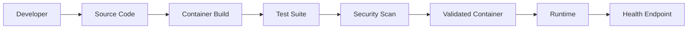

# ⚡ DevOps Health API

<p align="center">
  <strong>Production-style Python API for demonstrating containerization, testing, CI quality gates, and container security.</strong>
</p>

<p align="center">
  
  
  
  
  
</p>

> A compact DevOps portfolio project focused on **Build → Test → Scan → Run**.

## 🎯 Overview

`devops-health-api` is a small HTTP service intentionally designed to keep the application simple and make the engineering practices visible.

It demonstrates:

- REST health endpoints
- Automated tests with Pytest
- Reproducible Docker builds
- Non-root container execution
- Docker Compose local runtime
- Container health checks
- Container vulnerability scanning with Trivy
- Production-minded runtime hardening

## 🏗️ Architecture



## 📁 Repository Structure

```text
.
├── app.py
├── test_app.py
├── requirements.txt
├── Dockerfile
├── docker-compose.yml
├── .dockerignore
├── .gitignore
├── LICENSE
├── CONTRIBUTING.md
├── SECURITY.md
└── README.md
```

## 🚀 Quick Start

### Python

```bash
python3 -m venv .venv
source .venv/bin/activate
python -m pip install -r requirements.txt
python app.py
```

Windows activation:

```powershell
.venv\\Scripts\\Activate.ps1
python -m pip install -r requirements.txt
python app.py
```

### Docker Compose

```bash
docker compose up --build
```

Stop the service:

```bash
docker compose down
```

The API listens on port `8080`.

## 🧪 Testing

```bash
python -m pytest -q
```

The test suite validates the root service endpoint and the health endpoint.

## 📡 API Reference

| Method | Endpoint | Purpose |
|---|---|---|
| `GET` | `/` | Service metadata |
| `GET` | `/health` | Health status and UTC timestamp |

Example:

```json
{
  "status": "healthy",
  "timestamp": "2026-09-16T18:19:30+00:00"
}
```

## 🔐 Container Security

The runtime is intentionally hardened for a small demo service:

| Control | Implementation |
|---|---|
| Non-root process | Runs as dedicated UID/GID `10001` |
| Read-only filesystem | Enabled by Docker Compose |
| Temporary write area | `/tmp` mounted as a restricted tmpfs |
| Linux capabilities | All capabilities dropped |
| Privilege escalation | `no-new-privileges` enabled |
| Healthcheck | Container healthcheck calls `/health` |
| Dependency versions | Explicitly pinned |
| Secret hygiene | No credentials committed to source |

## 🔍 Vulnerability Scanning

Run Trivy locally when available:

```bash
trivy image devops-health-api:local
```

The scan should be reviewed before promoting an image to a shared or production environment.

## ☁️ Cloud Deployment Path

The repository is intentionally local-first. A natural production extension is:

```text
Developer
   ↓
Git / GitHub
   ↓
Test + Security Validation
   ↓
Docker Image
   ↓
Azure Container Registry
   ↓
Azure Container Apps / AKS
   ↓
Azure Monitor / Application Insights
```

The cloud deployment layer can later be implemented with Terraform and passwordless GitHub-to-Azure authentication.

## 💼 Skills Demonstrated

**Python · Flask · Docker · Docker Compose · Linux · Git · GitHub · Testing · Container Security · Trivy · CI/CD Concepts · Health Checks · Runtime Hardening**

## 🛣️ Roadmap

- Terraform-managed Azure infrastructure
- Azure Container Registry
- Azure Container Apps or AKS deployment
- GitHub OIDC to Azure
- Azure Key Vault
- Checkov IaC scanning
- Application metrics
- Azure Monitor / Application Insights
- Environment promotion: Dev → QA → Prod
- Image SBOM and signing

## 👤 Author

**Yesh Pal** — DevOps / Cloud Engineer

- GitHub: [@yeshpal-devops](https://github.com/yeshpal-devops)
- LinkedIn: [Yesh Pal](https://www.linkedin.com/in/yesh-pal/)

---

<p align="center"><strong>Build → Test → Scan → Ship</strong></p>
